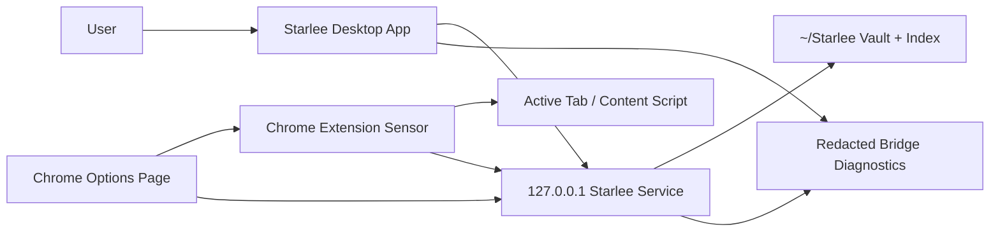

# PRD: Chrome Packaging and Desktop Integration

**Author:** Christian Karren
**Date:** 2026-06-25
**Status:** Draft
**Version:** 1.0
**Quality-Validated:** Yes

---

## Table of Contents

1. [Executive Summary](#executive-summary)
2. [Problem Statement](#problem-statement)
3. [Goals & Success Metrics](#goals--success-metrics)
4. [User Stories](#user-stories)
5. [Functional Requirements](#functional-requirements)
6. [Non-Functional Requirements](#non-functional-requirements)
7. [Technical Considerations](#technical-considerations)
8. [Implementation Roadmap](#implementation-roadmap)
9. [Out of Scope](#out-of-scope)
10. [Dependencies](#dependencies)
11. [Open Questions & Risks](#open-questions--risks)
12. [Validation Checkpoints](#validation-checkpoints)
13. [QA Checklist](#qa-checklist)
14. [Appendix: Task Breakdown Hints](#appendix-task-breakdown-hints)

---

## Executive Summary

Starlee needs Chrome installation and browser-bridge state to feel like one coherent desktop product. Today the Chrome extension can be generated, manually loaded, inspected as a ZIP, and diagnosed through `starlee doctor`, but normal users still have to understand `chrome://extensions`, local tokens, bridge heartbeat, site permissions, and capture tests as separate technical concepts. This PRD specifies the product and engineering requirements for making the Chrome extension installable, diagnosable, and integrated with the Starlee desktop app while preserving the system boundary: the desktop app owns onboarding, setup, diagnostics, library, and user-facing state; the Chrome extension owns page access and capture sensing.

The first milestone is a local unpacked-extension developer install that the desktop app can guide and verify end to end. The later milestone is a Chrome Web Store release path with permission rationale, privacy disclosure, reproducible package inspection, and build identity. Success means a user can install or reload the Chrome sensor, see whether it has checked in recently, understand when permission is needed, run a capture test, and trust that article bodies, transcripts, selected text, cookies, and tokens remain out of diagnostics and release packages.

---

## Problem Statement

### Current Situation

Starlee already has important browser-capture primitives:

- `scripts/package-chrome-extension.sh` builds a Chrome ZIP from `sensor/dist/extension`.
- `scripts/inspect-chrome-extension-package.sh` rejects local config, vault data, model files, source maps, bearer-token material, and unexpected remote fetch destinations.
- `README.md` documents the unpacked install path through `~/Starlee/sensor-extension` and `chrome://extensions`.
- `docs/chrome-extension-release.md` explains the Manifest V3 package, permission decision, local-only network boundary, and manual Chrome Web Store steps.
- The local service exposes `/health`, `/extension/hello`, `/bridge-health`, `/capture-request`, `/capture-request/status`, `/capture-request/result`, and `/capture-diagnostics/event`.
- `starlee doctor` and `starlee diagnostics` expose redacted browser-bridge health and capture traces.
- The extension options page can store a capture token and port, test the local connection, and display bridge health details.

These pieces are real but still feel fragmented. A user can install the macOS app and extension assets, yet Chrome does not automatically treat those generated files as an installed extension. The desktop app cannot yet present a single, plain status model such as installed, checked in recently, permission needed, and capture test passed. The Chrome options page displays useful information, but it is not yet aligned with a desktop setup checklist or release-channel story. The Chrome Web Store package path exists, but the product still needs a release-grade definition of build identity, permission rationale, privacy disclosure, and QA.

### User Impact

**Who is affected:** Mac users who read articles, newsletters, logged-in pages, and YouTube watch pages in Chrome or Chromium-family browsers and want to save them into Starlee.

**Pain point:** Users have to translate developer artifacts into product state. A redacted bridge report may say the extension has not checked in, but the user needs a next step: install the extension, reload it, open Starlee, grant site access, or run a capture test.

**Severity:** High for activation. Starlee's value begins after the first successful browser capture. If setup stalls at Chrome permissions or token configuration, the user never reaches the daily capture loop.

### Business Impact

**Cost of problem:** Lower setup completion, more support time spent interpreting bridge diagnostics, lower confidence in browser permissions, and fewer repeat captures.

**Strategic importance:** Chrome is the reference browser implementation for Starlee capture. A polished Chrome integration creates the baseline for future Safari and Web Store decisions without moving ownership of onboarding into the extension.

**Opportunity cost:** Without a reliable desktop-guided Chrome path, the product can have strong extraction logic but still feel unfinished because the installation and status surface is unclear.

### Why Solve This Now?

The capture stack has reached the point where Chrome can act as Starlee's reference browser sensor. The next bottleneck is not extraction logic; it is installability, explainability, and release confidence. Packaging and desktop integration should be specified now so future extraction work ships behind an install path users can understand and support can diagnose from redacted state.

### Assumptions

- The first implementation targets macOS with Chrome stable as the reference browser.
- Local unpacked extension install remains required before Chrome Web Store availability.
- The desktop app can open local folders, Chrome setup URLs, docs, and diagnostic views, but Chrome must still require explicit user approval for extension installation and page access.
- The extension communicates only with the Starlee loopback service at `127.0.0.1`.
- Diagnostics may include redacted metadata such as browser name, extension version, build identity, URL/domain/title snippets, status codes, timestamps, and bounded error messages.
- Diagnostics must not include page body, transcript text, selected text, cookies, bearer tokens, OAuth tokens, or local vault body content.

---

## Goals & Success Metrics

### Goal 1: Complete a local unpacked Chrome install with desktop guidance

- **Metric:** Median time from opening Starlee setup to healthy Chrome bridge.
- **Baseline:** Manual README flow requiring `chrome://extensions`, Developer Mode, folder selection, reload, and `starlee doctor` interpretation.
- **Target:** <3 minutes median for a user starting from installed Starlee assets and Chrome stable.
- **Timeframe:** First implementation milestone.
- **Measurement Method:** Manual usability runs plus local redacted setup events: `extension_assets_found`, `chrome_setup_opened`, `extension_hello_seen`, `capture_test_passed`.

### Goal 2: Present a single desktop setup status model

- **Metric:** Percentage of setup states represented by a specific desktop status and next action.
- **Baseline:** Bridge health exists in CLI/options diagnostics; desktop status model is not specified as a product contract.
- **Target:** 100% coverage for installed, checked in recently, permission needed, capture test passed, service unreachable, token invalid, and extension unavailable states.
- **Timeframe:** First implementation milestone.
- **Measurement Method:** Unit tests for status mapping plus manual desktop screenshots for each fixture state.

### Goal 3: Preserve local-only privacy during install, diagnostics, and release packaging

- **Metric:** Number of captured content bodies, transcript texts, selected texts, cookies, or tokens emitted to diagnostics or packaged ZIPs.
- **Baseline:** Existing inspection and sanitizer gates cover many cases, but the product status requirements are spread across docs and code.
- **Target:** 0 prohibited values in CLI diagnostics, desktop setup status, options page status, capture test output, and Chrome release ZIP.
- **Timeframe:** Continuous.
- **Measurement Method:** Package inspection, diagnostic sanitizer tests, bridge smoke tests, and manual review of desktop/options page copy.

### Goal 4: Prepare a later Chrome Web Store path without blocking local development

- **Metric:** Release checklist completion for a store candidate ZIP.
- **Baseline:** `docs/chrome-extension-release.md` has a draft listing and manual steps.
- **Target:** Store candidate includes reproducible ZIP, package inspection pass, permission rationale, privacy disclosure, version/build identity, screenshots, support path, and clean-profile install verification.
- **Timeframe:** After local unpacked install reaches the target above.
- **Measurement Method:** QA checklist sign-off and Chrome Web Store unlisted beta submission record.

---

## User Stories

### Story 1: Local unpacked install from the desktop app

**As a** Starlee user setting up Chrome capture,
**I want to** follow desktop-guided steps for loading the local unpacked extension,
**So that** I can install the page sensor without reading separate terminal instructions.

**Acceptance Criteria:**

- [ ] Desktop setup detects whether `~/Starlee/sensor-extension/manifest.json` exists.
- [ ] Desktop setup shows the exact extension folder path and provides a button to reveal it in Finder.
- [ ] Desktop setup opens `chrome://extensions` or displays a copyable instruction when Chrome blocks direct navigation.
- [ ] Desktop setup explains that Developer Mode and Load Unpacked are required only for the local development channel.
- [ ] Desktop setup refreshes bridge state after Chrome loads or reloads the extension.
- [ ] Setup does not display the full capture token.

**Task Breakdown Hint:** Desktop setup UI (~8h), folder detection and reveal action (~4h), Chrome setup launcher (~4h), redacted setup copy (~3h), manual install fixture checklist (~3h).

**Dependencies:** Generated extension assets from `starlee setup`; macOS app setup/status surface; Chrome stable.

### Story 2: Understand current Chrome bridge state

**As a** user who has loaded the extension,
**I want to** see one desktop status that tells me whether Chrome capture is ready,
**So that** I know whether to grant permission, reload the extension, start Starlee, or run a capture test.

**Acceptance Criteria:**

- [ ] Desktop app displays the four primary setup states: installed, checked in recently, permission needed, capture test passed.
- [ ] Desktop app maps `/bridge-health` fields to user-facing state: `extension_setup_present`, `extension_config_present`, `checked_in_recently`, `can_capture_active_tab`, `last_hello_at`, `last_request_status`, `last_failure_reason`, and `recommended_next_action`.
- [ ] State refresh completes within 1 second when the local service is reachable.
- [ ] Stale extension heartbeat uses the existing 5 minute freshness window unless this PRD is superseded by a future bridge contract.
- [ ] Permission-needed state distinguishes missing site access from extension not installed when bridge data can support that distinction.
- [ ] Capture-test-passed state records the latest successful test timestamp and does not imply that all future pages are capturable.

**Task Breakdown Hint:** Status mapping model (~6h), desktop status view (~10h), bridge refresh control (~4h), state fixture tests (~8h), copy review (~2h).

**Dependencies:** `/bridge-health`, `/extension/hello`, capture request status lifecycle, desktop app status window.

### Story 3: Test capture before daily use

**As a** user completing setup,
**I want to** run a capture test from the desktop app,
**So that** I know Chrome, extension permissions, the local service, and vault writing work together.

**Acceptance Criteria:**

- [ ] Desktop app offers a "Test Chrome Capture" action after the extension has checked in recently.
- [ ] The test uses the same `/capture-request` lifecycle as menu-bar capture.
- [ ] The test result maps terminal statuses to specific next actions: `capture_saved`, `permission_denied`, `unsupported_page`, `extension_unavailable`, `content_script_unreachable`, `timed_out`, and `capture_failed`.
- [ ] The test can be run against a local fixture page during QA.
- [ ] The test completes in <10 seconds for a reachable extension and local fixture.
- [ ] Test output does not include page body, transcript text, selected text, cookies, or tokens.

**Task Breakdown Hint:** Desktop capture-test action (~6h), result polling UI (~8h), local fixture route or documentation (~6h), redaction tests (~6h), QA script update (~3h).

**Dependencies:** `/capture-request`, `/capture-request/status`, extension active-tab capture, local vault capture path.

### Story 4: Configure and diagnose from the Chrome options page

**As a** user who opens the extension settings page,
**I want to** see connection state, build identity, and privacy boundaries,
**So that** I can fix local configuration without exposing secrets.

**Acceptance Criteria:**

- [ ] Options page shows local service state: connected, service unreachable, token missing, token rejected, bridge stale, permission needed, or last capture failed.
- [ ] Options page shows extension version and build identity.
- [ ] Options page can save local port and capture token into Chrome local extension storage.
- [ ] Options page never reprints a stored capture token after save.
- [ ] Options page links or names the desktop setup path for users who need full onboarding.
- [ ] Options page text states that captures are posted only to `127.0.0.1` and that content is stored by the local Starlee app.

**Task Breakdown Hint:** Options state taxonomy (~4h), UI copy and build identity fields (~5h), token/port persistence tests (~5h), bridge-health render tests (~6h).

**Dependencies:** `sensor/extension/options.html`, `sensor/src/options.js`, Chrome storage, `/bridge-health`, `/extension/hello`.

### Story 5: Release a store candidate with privacy and permission rationale

**As a** Starlee maintainer,
**I want to** package and inspect a Chrome release candidate,
**So that** I can submit an unlisted Chrome Web Store build with confidence.

**Acceptance Criteria:**

- [ ] Release ZIP is produced by `scripts/package-chrome-extension.sh`.
- [ ] Release ZIP passes `scripts/inspect-chrome-extension-package.sh`.
- [ ] Manifest permissions have a documented rationale for `storage`, `activeTab`, `tabs`, `alarms`, `http://127.0.0.1/*`, and current HTTP/HTTPS content-script access.
- [ ] Store listing copy states the extension is a browser sensor for local Starlee and does not upload captured bodies or transcripts to external services.
- [ ] Release notes include extension version, build identity, git commit when available, and packaging timestamp.
- [ ] Clean Chrome profile QA covers install, options connection, extension check-in, toolbar capture, menu-bar capture, permission recovery, and package inspection.

**Task Breakdown Hint:** Release metadata design (~5h), package script updates (~6h), inspection script updates (~5h), store listing asset checklist (~4h), clean-profile QA runbook (~5h).

**Dependencies:** `sensor/package.json`, manifest, package/inspect scripts, release docs, Chrome Web Store developer account.

---

## Functional Requirements

### Must Have (P0)

#### REQ-001: Desktop-guided local unpacked Chrome install

**Priority:** P0

**Description:** Starlee desktop setup must guide the user through the local unpacked Chrome extension install using generated assets from `~/Starlee/sensor-extension`.

**Acceptance Criteria:**

- [ ] Detect `manifest.json` and `starlee-config.json` separately.
- [ ] Display the extension folder path without revealing token values.
- [ ] Offer actions to reveal the folder, open Chrome extension management, and refresh bridge state.
- [ ] Represent missing assets as a setup-blocking state with the next action "Run starlee setup" or the desktop equivalent.
- [ ] Include local development wording that distinguishes unpacked install from the later Chrome Web Store path.

**Task Breakdown:** Asset detection model (~3h), desktop actions (~6h), setup copy (~3h), status fixtures (~4h).

**Dependencies:** `starlee setup`, `sensor_assets.rs`, desktop app window.

#### REQ-002: Canonical desktop Chrome setup status

**Priority:** P0

**Description:** Starlee must expose one desktop status model for Chrome capture setup with the fields `installed`, `checked_in_recently`, `permission_needed`, and `capture_test_passed`.

**Acceptance Criteria:**

- [ ] `installed` is true only when extension assets exist and the desktop app can identify the intended Chrome install channel.
- [ ] `checked_in_recently` mirrors `/bridge-health.checked_in_recently`.
- [ ] `permission_needed` is true when the extension is installed or checked in but active-tab capture is unavailable, or when the latest terminal capture status is `permission_denied`.
- [ ] `capture_test_passed` is true only after a successful capture-test request in the current setup profile.
- [ ] Each false state includes one next action and one diagnostic detail.

**Task Breakdown:** Status contract (~4h), bridge mapping (~5h), desktop rendering (~8h), tests for each state (~8h).

**Dependencies:** `/bridge-health`, capture request terminal statuses, desktop app.

#### REQ-003: Extension check-in and build identity

**Priority:** P0

**Description:** The Chrome extension must identify itself to the local service with browser name, extension version, build identity, and active-tab capability.

**Acceptance Criteria:**

- [ ] `/extension/hello` receives `browser`, `extension_version`, `extension_build`, and `can_capture_active_tab`.
- [ ] Extension build identity is derived from package version plus git commit or build timestamp when available.
- [ ] Desktop app and options page both display version and build identity.
- [ ] `starlee doctor`, `starlee status`, and `starlee diagnostics --last-capture` can report the identity without tokens or captured content.
- [ ] Unknown build identity is displayed as `unknown`, not blank.

**Task Breakdown:** Build metadata generation (~5h), background hello payload (~3h), desktop/options rendering (~5h), Rust state tests (~5h).

**Dependencies:** `sensor/package.json`, manifest, `Engine::record_extension_hello`, local config schema.

#### REQ-004: Desktop capture test

**Priority:** P0

**Description:** The desktop app must provide a Chrome capture test that exercises the real menu-bar bridge and reports a terminal result.

**Acceptance Criteria:**

- [ ] Test creates a `/capture-request` using source `desktop-setup-test` or equivalent.
- [ ] Test polls `/capture-request/status` until terminal status or 10 second timeout.
- [ ] Terminal statuses map to `passed`, `permission_needed`, `unsupported_page`, `extension_unavailable`, `content_script_unreachable`, `timed_out`, or `failed`.
- [ ] A passed test records a timestamp for `capture_test_passed`.
- [ ] Test output includes page title/domain/URL only when sanitized by existing bridge metadata rules.

**Task Breakdown:** Setup-test request source (~3h), desktop polling UI (~7h), result mapping (~4h), fixture/manual QA (~5h).

**Dependencies:** Capture request bridge, extension polling, local capture endpoint.

#### REQ-005: Chrome options page parity with desktop state

**Priority:** P0

**Description:** The Chrome options page must display the same connection and bridge state vocabulary as desktop setup.

**Acceptance Criteria:**

- [ ] Options page renders connected, service unreachable, token missing, token rejected, bridge stale, permission needed, and last capture failed states.
- [ ] Options page shows last handshake time, browser, extension version, build identity, local port, and last capture status.
- [ ] Options page provides a test connection action that triggers `STARLEE_HELLO` and refreshes `/bridge-health`.
- [ ] Options page storage keeps token write-only after save.
- [ ] Options page text links the local service to the desktop app as the owner of onboarding and library state.

**Task Breakdown:** Shared status labels (~4h), options UI update (~6h), message handling tests (~6h), manual options QA (~2h).

**Dependencies:** `sensor/src/options.js`, extension background messages, `/bridge-health`.

#### REQ-006: Permission rationale and user disclosure

**Priority:** P0

**Description:** Starlee must document and show a permission rationale for every Chrome permission and host permission used by the extension.

**Acceptance Criteria:**

- [ ] Rationale covers `storage`, `activeTab`, `tabs`, `alarms`, `http://127.0.0.1/*`, `http://*/*`, and `https://*/*`.
- [ ] User-facing copy explains that broad page access exists so the native menu-bar capture path can reach pages after user installation.
- [ ] Copy states the extension reads page content only when the user chooses capture or when preparing the page sensor for capture.
- [ ] Copy states captured content is posted to the local Starlee service and not to a remote Starlee server.
- [ ] Release docs include future review of a narrower permission model as a follow-up.

**Task Breakdown:** Permission audit (~4h), desktop/options copy (~4h), release doc update (~3h), reviewer checklist (~2h).

**Dependencies:** Manifest, Chrome release docs, desktop setup copy.

#### REQ-007: Privacy-preserving diagnostics

**Priority:** P0

**Description:** Setup status, options status, doctor output, diagnostics, and capture test output must exclude private content and secrets.

**Acceptance Criteria:**

- [ ] No diagnostic surface includes capture token, OAuth token, cookies, page body, selected text, transcript text, HTML, embeddings, or local vault body content.
- [ ] Diagnostic string fields are bounded to existing bridge limits or stricter limits: keys <=80 characters, messages <=240 characters, URLs <=2048 characters.
- [ ] Recent desktop setup diagnostics omit request IDs unless the user opens the explicit last-capture trace.
- [ ] Package inspection rejects local config and token-like material.
- [ ] Tests include at least one forbidden-value fixture for desktop/options/CLI surfaces.

**Task Breakdown:** Redaction inventory (~4h), test fixtures (~6h), desktop/options sanitizer use (~6h), inspection update (~3h).

**Dependencies:** `engine/bridge.rs`, package inspection script, desktop/options status rendering.

### Should Have (P1)

#### REQ-008: Release package metadata and inspection

**Priority:** P1

**Description:** Chrome packaging must produce a release candidate with explicit version/build identity and an inspection report suitable for pre-upload review.

**Acceptance Criteria:**

- [ ] Package script writes `release/chrome-extension/starlee-capture-<version>.zip`.
- [ ] Package script removes `starlee-config.json`, source maps, local vault files, model files, `node_modules`, and build caches.
- [ ] Inspection script verifies manifest, background worker, content script, options page, PNG icons, and expected network destinations.
- [ ] Inspection output includes package path, version, build identity, file count, and pass/fail result.
- [ ] Release docs name the exact commands required before upload.

**Task Breakdown:** Inspection metadata (~4h), package metadata file (~4h), docs update (~3h), CI/manual command update (~3h).

**Dependencies:** Package scripts, manifest, `sensor/package.json`.

#### REQ-009: Chrome Web Store readiness path

**Priority:** P1

**Description:** Starlee must define the later Chrome Web Store path without requiring Web Store availability for local unpacked development.

**Acceptance Criteria:**

- [ ] Docs distinguish local unpacked channel, unlisted beta channel, and public listing channel.
- [ ] Store listing draft includes short description, long description, privacy disclosure, permission rationale, support contact, and screenshot checklist.
- [ ] Store QA requires a clean Chrome profile install.
- [ ] Desktop setup can represent a future Web Store install path without changing the extension ownership boundary.
- [ ] Release checklist blocks public launch until unlisted beta install and capture tests pass.

**Task Breakdown:** Channel model (~4h), store docs (~5h), desktop copy placeholders (~3h), release checklist update (~3h).

**Dependencies:** Chrome Web Store account, release docs, desktop setup UI.

#### REQ-010: Setup and release QA checklist

**Priority:** P1

**Description:** The project must maintain a QA checklist that covers local unpacked install, bridge status, capture test, options page, package inspection, and Web Store candidate verification.

**Acceptance Criteria:**

- [ ] Checklist includes clean profile, existing profile, service stopped, token invalid, permission denied, unsupported page, article capture, YouTube capture, and metadata-only YouTube result.
- [ ] Checklist includes the commands `make package-chrome` and `scripts/inspect-chrome-extension-package.sh`.
- [ ] Checklist includes desktop setup screenshots or recorded states for installed, checked in recently, permission needed, and capture test passed.
- [ ] Checklist includes a network review proving capture payloads go only to `127.0.0.1`.
- [ ] Checklist includes rollback or reinstall steps for local unpacked development.

**Task Breakdown:** QA matrix (~5h), screenshot capture plan (~3h), package/network verification steps (~4h), docs update (~3h).

**Dependencies:** Desktop status implementation, extension test fixtures, package scripts.

---

## Non-Functional Requirements

- **Setup latency:** Desktop bridge status refresh must complete in <1 second when `127.0.0.1:<port>` is reachable and <2 seconds when unreachable.
- **Heartbeat freshness:** Extension check-in is considered fresh for 5 minutes, matching `EXTENSION_HEARTBEAT_FRESHNESS`.
- **Capture test duration:** Desktop capture test must reach a terminal state in <10 seconds for the local fixture or return `timed_out`.
- **Package size:** Chrome release ZIP should remain <5 MB until additional visual assets require a larger limit.
- **Diagnostics bounds:** Rolling capture diagnostics must retain no more than 120 events, matching the current bridge buffer.
- **Privacy invariant:** 0 occurrences of token, cookie, page body, selected text, transcript text, or vault body content in diagnostics, desktop setup status, options page status, and release ZIP inspection fixtures.
- **Compatibility target:** Chrome stable on the current macOS release and the previous major macOS release for local unpacked install.

---

## Technical Considerations

### Architecture

### Component Responsibilities

- **Desktop app:** Owns onboarding, setup status, setup actions, capture test display, diagnostics display, and user-facing next actions.
- **Chrome extension:** Owns active tab lookup, content-script reachability, article/YouTube extraction, local payload posting, and extension check-in.
- **Local service:** Owns token authentication, bridge health, capture request lifecycle, diagnostic sanitization, vault writes, indexing, and status APIs.
- **Packaging scripts:** Own reproducible Chrome ZIP generation and release candidate inspection.
- **Options page:** Owns extension-local configuration and extension-scoped diagnostics, while directing broader setup back to desktop.

### Existing Interfaces To Reuse

- `POST /extension/hello`
- `GET /bridge-health`
- `POST /capture-request`
- `GET /capture-request`
- `GET /capture-request/status?id=<id>`
- `POST /capture-request/result`
- `POST /capture-diagnostics/event`
- `POST /capture`
- `starlee doctor`
- `starlee diagnostics --last-capture`
- `scripts/package-chrome-extension.sh`
- `scripts/inspect-chrome-extension-package.sh`

### Status Mapping

| Product State | Primary Inputs | User Next Action |
| --- | --- | --- |
| `installed` | extension assets exist, Chrome path/channel selected | Load or reload extension if not checked in |
| `checked_in_recently` | `/bridge-health.checked_in_recently=true` | Run capture test |
| `permission_needed` | `can_capture_active_tab=false` or terminal `permission_denied` | Grant site access and reload tab |
| `capture_test_passed` | setup test terminal `capture_saved` | Start capturing from menu bar or toolbar |
| `service_unreachable` | `/health` or `/bridge-health` unreachable | Open Starlee or start service |
| `token_invalid` | 401 from authenticated bridge endpoint | Regenerate setup or save correct token locally |
| `extension_unavailable` | stale heartbeat or terminal `extension_unavailable` | Load or reload extension |

---

## Implementation Roadmap

### Phase 1: Local Unpacked Setup Integration

- Define desktop Chrome setup status model.
- Add UI/actions for extension folder, Chrome extension management, refresh, and test.
- Align options page labels with desktop state.
- Add redaction fixtures for setup and options surfaces.

### Phase 2: Capture Test and Diagnostics

- Add desktop capture test source and terminal result mapping.
- Add local fixture QA path.
- Add desktop screenshots or deterministic UI state snapshots for setup states.
- Update `starlee doctor` and diagnostics docs if new fields are added.

### Phase 3: Release Candidate Readiness

- Add build identity to extension package and check-in.
- Expand package inspection output.
- Update release docs, privacy disclosure, and permission rationale.
- Run clean Chrome profile QA and prepare unlisted Web Store beta assets.

---

## Out of Scope

- Safari fixes or Safari packaging changes.
- Implementing a narrower host-permission model in this PRD.
- Automating Chrome's user approval for loading unpacked extensions or granting site access.
- Live YouTube dependency for setup QA.
- Remote telemetry, cloud sync, or external capture upload.
- Replacing the local token authentication model.
- Building the Chrome Web Store listing UI inside Starlee.

---

## Dependencies

- Chrome stable on macOS.
- Generated extension assets in `~/Starlee/sensor-extension`.
- Starlee loopback service on `127.0.0.1:<capture_port>`.
- Existing bridge endpoints and diagnostic sanitizer.
- Desktop app status window and menu-bar app.
- Chrome extension options page.
- Package and inspection scripts.
- Chrome Web Store developer account for the later unlisted beta path.

---

## Open Questions & Risks

- **Chrome URL launching:** Chrome may not permit direct navigation to `chrome://extensions` from another app in every environment. Mitigation: reveal the extension folder and show exact manual steps when direct open fails.
- **Permission interpretation:** `can_capture_active_tab=false` may represent several browser conditions. Mitigation: pair it with latest terminal status and content-script diagnostics before showing `permission_needed`.
- **Broad host permissions:** Current menu-bar capture relies on content scripts for HTTP/HTTPS pages. Mitigation: document the rationale now and track a future permission minimization project.
- **Web Store review:** Chrome Web Store reviewers may ask for clearer single-purpose and host-permission justification. Mitigation: maintain release copy and screenshots that show local-only capture.
- **Version skew:** Desktop app, bundled extension assets, and installed Chrome extension may diverge. Mitigation: display extension version/build identity and recommend reload/update when mismatched.

---

## Validation Checkpoints

1. **PRD validation:** `prd-writer` grade is EXCELLENT.
2. **Unit validation:** Status mapping tests cover every product state in this PRD.
3. **Desktop validation:** Manual desktop setup run reaches `capture_test_passed` from a clean local profile in <3 minutes.
4. **Bridge validation:** `starlee doctor` reports healthy `browser_bridge` after extension reload.
5. **Options validation:** Options page reports connected state, version/build identity, port, last handshake, and last capture status.
6. **Privacy validation:** Forbidden-value fixtures do not appear in diagnostics, setup state, options state, or package inspection output.
7. **Packaging validation:** `make package-chrome` and `scripts/inspect-chrome-extension-package.sh release/chrome-extension/starlee-capture-<version>.zip` pass.
8. **Clean profile validation:** Chrome clean profile can load the unpacked extension, check in, run capture test, capture an article, and recover from permission denial.

---

## QA Checklist

- [ ] Run `starlee setup` and confirm `~/Starlee/sensor-extension/manifest.json` exists.
- [ ] Open desktop Chrome setup and verify missing/installed states.
- [ ] Reveal the extension folder from desktop setup.
- [ ] Load unpacked extension in a clean Chrome profile.
- [ ] Confirm options page shows local port, version, build identity, and no token value.
- [ ] Confirm `/extension/hello` updates `last_hello_at`.
- [ ] Confirm desktop status shows checked in recently within 5 minutes.
- [ ] Run desktop capture test on a local article fixture.
- [ ] Verify permission-denied state by revoking site access and retrying.
- [ ] Verify unsupported-page state on `chrome://extensions` or another unsupported URL.
- [ ] Verify service-unreachable state with the local service stopped.
- [ ] Verify token-invalid state with a wrong stored token.
- [ ] Capture one article fixture and one YouTube fixture without live YouTube dependency.
- [ ] Confirm diagnostics do not include page body, transcript text, selected text, cookies, or tokens.
- [ ] Run `make package-chrome`.
- [ ] Run `scripts/inspect-chrome-extension-package.sh release/chrome-extension/starlee-capture-<version>.zip`.
- [ ] Inspect Chrome release ZIP file list for manifest, background, content, options, and PNG icons.
- [ ] Complete clean-profile release candidate install before Web Store upload.

---

## Appendix: Task Breakdown Hints

- Desktop setup state model and UI: ~24h
- Desktop capture test action and result mapping: ~18h
- Options page state parity and build identity: ~16h
- Build identity generation and check-in persistence: ~13h
- Privacy disclosure and permission rationale updates: ~10h
- Package inspection metadata and release docs: ~14h
- QA matrix, fixtures, and manual release runbook: ~15h
